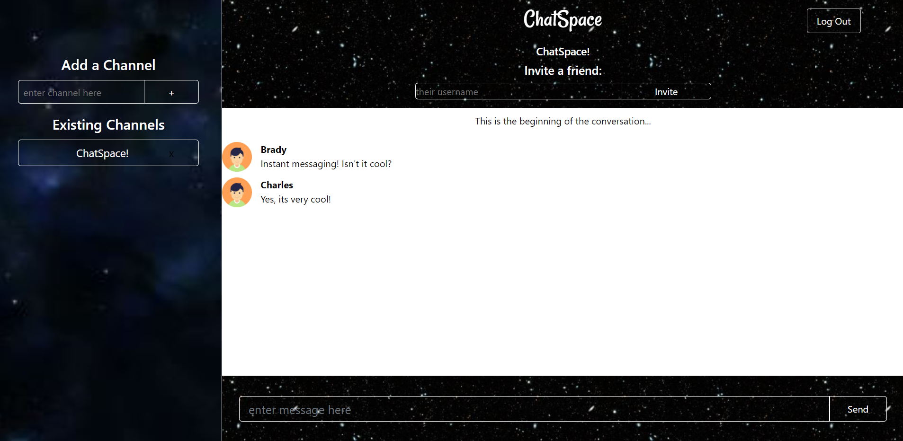

## ChatSpace 2.0
###### Deployed version: https://sleepy-island-09705.herokuapp.com/  
ChatSpace 2.0 was developed as the third group project for University of Richmond Bootcamp (May-October 2019).

ChatSpace 2.0 serves as a Discord or Slack lite app by allowing for instant messaging across groups, from one person to another. The concept of this app is to build something that is relatable to the world of Web Development, that is user friendly and possesses entertainment value for users who may be outside the development world.

## A sample of what it looks like:  

## Built With

* `Axios`  
* `bcryptJS`  
* `Express`  
* `Express-session`  
* `Passport`  
* `MongoDB`  
* `Socket.io`  
* `React`  

## Written By

"The ABC's": Ashlie Johnson, Brady Douthit, Charles Mercer, and Cory W.

## Acknowledgments

Huge shout-out to the creator of this repo https://github.com/b-bly/simple-mern-passport for giving us a basic setup to save some time on this project.
